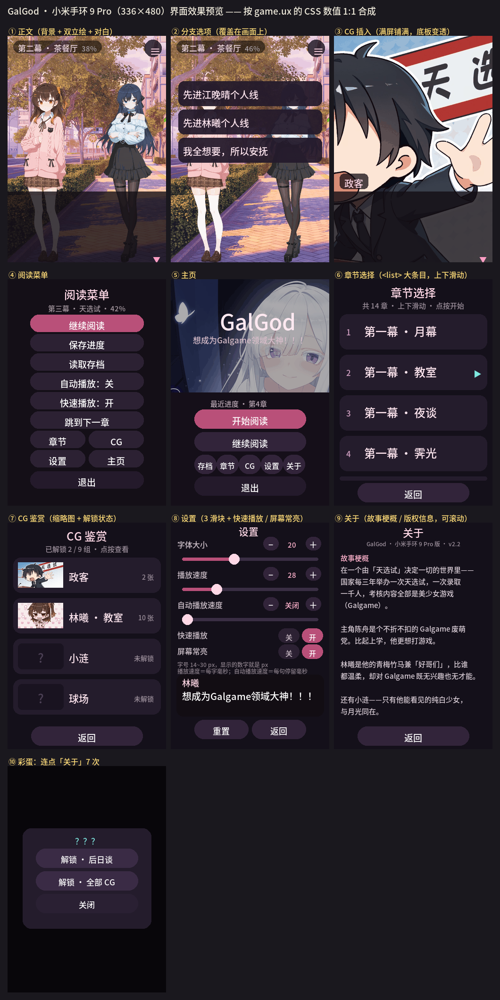

# GalGod · 小米手环 9 Pro 版

把 PC 版 Ren'Py galgame **GalGod 1.0.0** 移植成能在**小米手环 9 Pro**（336×480 矩形 AMOLED）上跑的 **Vela 快应用**。

引擎与 UI 参照开源工程 [qihe114514/galgaoshou-vela](https://github.com/qihe114514/galgaoshou-vela)（《难道你是GAL高手》手环移植）的架构：**索引 + 分块剧本的流式阅读器 + 声明式图片绑定 + storage 存档**。

```
剧本数据  5,569 个节点 / 18 章 / 44 个分块
对话      5,457 句（全量，非删减）
美术      136 张（背景 38 **宽幅 504×480** / 立绘 55 / CG 34 / 鉴赏缩略图 9）+ 标题画 + 图标
分支      15 个选择点，3 条结局线 + 1 个 Bad End
CG 鉴赏   9 组 / 32 张差分图，按原作 gallery.rpy 的分组与解锁条件
页面      7 个：主页 / 正文 / 存档 / 章节 / CG 鉴赏 / 设置 / 关于
协议      代码 MIT（见 LICENSE）；剧本与美术资源不在 MIT 范围内（见 NOTICE.md）
产物      dist/com.galgod.band.debug.2.3.rpk   5.69 MB
```

> **免责声明**：本项目是非官方的个人移植，仅供学习交流。
> 剧本文字与全部美术资源（背景 / 立绘 / CG）版权归 **GalGod** 原开发商“诺提拉观察所”所有。  
> 本仓库出于「可运行」的需要收录了转码后的资源，请不要用于任何商业用途。  
> 本仓库内容以“原样”制作，无暗自魔改。  
> 本仓库的**代码**部分可自由参考。详见文末「九、版权与开源协议」。   

---

## 故事梗概

> 以下为原作设定的简介。

**世界观**

在一个由「天选试」决定一切的世界里——国家每三年举办一次天选试，一次录取一千人，
考核内容**全部是美少女游戏（Galgame）**。通过者握有制定规则、影响国运的权力。

> 万般皆下品，惟有旮旯高。
> 一个亿万富翁，在一个 20 来岁、擅长 Galgame 的「天选之子」面前，也会自觉矮上一头。

**主要角色**

| 角色 | 简介 |
|---|---|
| **陈舟**（主角） | 不折不扣的 Galgame 废萌党。比起上学，他更想打游戏。 |
| **林曦** | 他的青梅竹马兼「好哥们」，比谁都温柔，却对 Galgame 既无兴趣也无才能。 |
| **江晚晴** | 永远一副尽在掌握的样子，在三人之间斡旋，一步步走向她要的结局。 |
| **小涟** | 只有他能看见的纯白少女，与月光同在。 |
| **诺提拉** | 后日谈里出现的金瞳少女。 |

**主线**

故事从再平凡不过的上学路开始，很快就撞上「天选试」这道门槛——
高考与天选试、现实与游戏、孤独与理解，全都压在这一个选择上。

随着校园日常（间章、茶餐厅、街道、雨夜）的推进，他渐渐意识到：
**自己正身处一部「现实的 Galgame」之中**，而小涟就像是那个「真女主」。

可身为废萌党，他偏偏认定——

> 废萌不该有钦定的真女主。
> 所有女主，都应该是平等的。

于是「选择」这两个字，变得越来越沉重。

---

## 一、目录结构

```
GalGod手环版/
├─ package.json              npm 脚本与 aiot-toolkit 依赖
├─ LICENSE                   本项目**代码**的 MIT 协议
├─ NOTICE.md                 素材版权说明（哪些内容不在 MIT 范围内）
├─ src/                      快应用源码（Vela 固定目录名）
│  ├─ manifest.json          应用清单：包名/图标/路由/features/designWidth
│  ├─ app.ux                 应用入口（本工程不用全局生命周期）
│  ├─ common/
│  │   ├─ assets.js          ← 生成：图片索引表（剧本里的资源号就是数组下标）
│  │   ├─ cglist.js          ← 生成：CG 鉴赏分组与解锁条件
│  │   ├─ reader.js          公共逻辑：设置项、storage 封装、换行与分页、自动播放时长
│  │   ├─ home.png           标题画（由游戏 main_screen 转出）
│  │   ├─ icon.png           应用图标
│  │   ├─ img/b/*.png        ← 生成：背景 336×480
│  │   ├─ img/s/*.png        ← 生成：立绘 143×380（带透明通道）
│  │   ├─ img/c/*.png        ← 生成：CG / SDCG 336×480（满屏）
│  │   ├─ img/t/g0..8.png    ← 生成：CG 鉴赏缩略图 96×54
│  │   └─ story/
│  │       ├─ index.txt      ← 生成：章节表 + 分块表（内容是 JSON，用 .txt 扩展名）
│  │       └─ chunk-000.txt… ← 生成：44 个分块，每块 128 个节点
│  └─ pages/
│      ├─ index/             主页：继续 / 开始 / 存档 / 章节 / CG / 设置 / 关于 / 退出
│      ├─ game/              正文阅读器（引擎核心）
│      ├─ saves/             存档 / 读档（6 个手动槽 + 自动存档）
│      ├─ chapters/          章节选择（14 章正片，通关后多出后日谈）
│      ├─ cg/                CG 鉴赏（9 组，含大图查看）
│      ├─ settings/          设置（字号 / 播放速度 / 自动播放 / 快速播放）
│      └─ about/             关于（故事梗概 / 版权信息 / 开源协议 + 彩蛋）
└─ tools/
    ├─ gen_story.py          剧本编译器：Ren'Py .rpy → 分块节点 + 图片索引
    ├─ gen_assets.py         美术生成器：大图 → 手环尺寸 PNG
    ├─ validate_story.py     剧本校验：分块完整性、引用越界、全图可达
    ├─ simulate.py           剧情流程模拟器：把全部路线跑一遍
    ├─ test_paginate.js      排版测试：抽取 reader.js/game.ux 的函数原文执行
    ├─ preview_ui.py         用真实资源按 CSS 数值合成界面效果图
    ├─ build.js              构建前静态检查 + 构建包装 + rpk 内容校验
    ├─ export_repo.py        导出「可上传 GitHub 的精简目录」
    └─ check_encoding.py     上传前自检：UTF-8 编码 / 误传文件 / README 图片
```

**仓库里已经带了生成好的剧本与美术资源**（`src/common/story/`、`src/common/img/`），
所以只想改代码的话直接 `npm install && npm run build` 就行，不需要原版游戏。
`gen_story.py` / `gen_assets.py` 是**溯源用**的——它们记录了资源是怎么从原版转出来的。

界面效果预览（`preview/ui-preview.png`，用真实资源按 `game.ux` 的 CSS 数值 1:1 合成）：



---

## 二、构建

```bash
npm install                    # 只有 aiot-toolkit 一个真正的依赖
npm run build                  # → dist/com.galgod.band.debug.2.3.rpk
npm run release                # → dist/com.galgod.band.release.2.3.rpk（需要 sign/ 下的证书）
npm run test                   # 排版 + 几何常量 + 全景参数一致性
npm run start                  # 起模拟器预览（需要 AIoT-IDE/模拟器环境）
```

> ⚠️ `aiot` **每次构建都会清空 `dist/`**，所以先构建 debug 再构建 release，
> debug 包会消失。两个都要留的话，构建完一个先把 rpk 挪出 `dist/`。

`npm run build` 用的是 `tools/build.js` 而不是直接 `aiot build`，原因见第五节。

改完代码想确认没弄坏东西，跑一条命令就够：

```bash
npm run check                  # = validate + simulate + test，全绿再提交
```

| 命令 | 作用 |
|---|---|
| `npm run build` / `npm run release` | 出 debug / release 包 |
| `npm run check` | 剧本校验 + 全部路线模拟 + 运行时分页测试 |
| `npm run test` | 只跑运行时分页测试（字号 14~30 全量） |
| `npm run validate` | 只跑剧本校验（分块、引用、全图可达） |
| `npm run simulate` | 只跑剧情流程模拟（8 条策略 + 三条结局覆盖） |
| `npm run preview` | 重新合成 `preview/ui-preview.png` |
| `npm run export` / `npm run verify` | 导出上传目录 / 上传前自检 |

从 Ren'Py 原始资源重新生成（需要 Python 3 + Pillow，以及 PC 版解包出来的 `game/` 目录）：

```bash
set GALGOD_RAW=D:\path\to\GalGod-1.0.0-win\game
python tools/gen_story.py  "%GALGOD_RAW%" .
python tools/gen_assets.py "%GALGOD_RAW%" .
python tools/validate_story.py .
python tools/simulate.py .
python tools/preview_ui.py "%GALGOD_RAW%" .
```

---

## 三、安装到手环（以**Astrobox**为例）

`dist/` 里的 **debug rpk 可以直接侧载**，不需要签名证书。

1. 手机装 **Astrobox**
2. 【设置】→【账号与安全】→ 登录小米账号→导入在小米运动健康绑定的设备→下面的请连接设备连接手环
3. 【探索】→ 点 `安装快应用` → 找下载的文件（可能在最近项目里，若没有点**左上角**三个杠<不是**右上角**三个点>找你手机的型号的图标，点开找Download或下载的文件夹，里面就有文件了）
4. 等**Astrobox**右下角的圆环跑满
5. 手环上会出现 **GalGod** 图标

> 官方 FAQ：<https://iot.mi.com/vela/quickapp/zh/guide/other/faq.html>
> 官方真机调试目前只支持 Xiaomi Watch S4，**手环 9 Pro 不在其列**，所以只能走上面这条侧载路径；查看运行日志要用小米运动健康的「拉取固件日志」。

**release 包**需要签名证书，`aiot release` 会报 `there is a problem with the certification path`：

```bash
mkdir sign
openssl req -newkey rsa:2048 -nodes -keyout sign/private.pem -x509 -days 3650 -out sign/certificate.pem
npm run release
```

---

## 四、运行时的设计

### 屏幕与单位

手环 9 Pro 官方参数：**336×480、矩形屏、1.74″、DPR 2.1、逻辑宽度 168dp**。
`manifest.json` 里 `designWidth: 336`，所以 **1px = 1 物理像素**，所有 CSS 数值直接按像素写，不需要换算，也不用媒体查询。

### 画面分层

| 层 | 元素 | 位置/尺寸 |
|---|---|---|
| 背景 | `<image>` `object-fit: cover` | 0,0 · 336×480 |
| 立绘 | 3 个固定槽位 `<image>` | left 10 / center 96 / right 182，宽 143 高 380，底边对齐 480 |
| CG | `<image>` 铺满 | 0,0 · 336×480 |
| 回忆滤镜 | 半透明色块 | 0,0 · 336×480，`opacity 0.22` |
| 顶部信息 | 章节名 + 章节进度 | 10,12 |
| 说话人 | 带自适应宽度底板的 `<text>` | 292,12（**浮在正文底板上方，不贴边**） |
| 对白面板 | 半透明底板 | 330,0 · 336×150 |
| 正文 | 6 个固定槽位 `<text>` | 338 起，行距 = 字号 + 4，宽 316 |
| 继续提示 | `▼` | 462,308 |

说话人原来放在 320，正好卡在底板上沿（当时底板在 312），看 CG 时底板还会下移到 333，
于是名字半悬在底板边缘上，看起来像错位。现在把版面统一成：

- **底板 330 起**（比原来低 18px，多露出 18px 画面），看 CG 时只改透明度、**不改位置**
- **说话人在 292**，自带一块跟着文字宽度走的半透明底板（靠 `<text>` 的
  `padding` + `background-color` + `border-radius` 实现，不需要固定宽度），
  和正文底板之间有 6px 间隙，亮色画面上也看得清
- 正文从 338 开始，正文区高 122 —— 取 122 是为了让最后一行（最长情况 458）
  停在下方的 `▼` 继续提示（462）之上

这些数值在 `game.ux` 顶部提成了常量（`PANEL_TOP` / `NAME_TOP` / `TEXT_TOP` /
`TEXT_BOX_H` …），只有一处定义。`tools/test_paginate.js` 会把它们和 CSS 里的实际值
**对一遍**，不一致就直接报错，避免 CSS 和 JS 各改一半导致错位。

正文**不用滚动**，而是在运行时按当前字号切页（见下面「排版」一节）：一句太长就变成多次点击。
这样在 336 宽的小屏上永远不会出现「文字被截掉」或「需要在一句话里滚动」的情况。
断行会优先落在标点之后，避免标点跑到行首。

### 剧本数据格式

`index.txt` 是索引，每块 128 个节点。节点类型：

| 类型 | 字段 | 含义 |
|---|---|---|
| `s` | `n` 说话人、`x` 原始台词、可选 `bg`/`cs`/`cg`/`tint` | 一句台词 |
| `o` | `o[]` 选项（`x` 文本 / `j` 目标 / `c` 显示条件） | 分支 |
| `j` | `j` | 无条件跳转 |
| `cj` | `v` 标记、`op`、`n`、`j` | 条件跳转 |
| `f` | `v`、`n` | 标记累加（原作里的好感/答题计数） |
| `sf` | `v`、`n` | 标记赋值（例如 `true_end_finish`） |
| `e` | `x` | 结局，回标题 |

台词存的是**原始文本**（字段 `x`），分页由运行时按当前字号现算，见下面「排版」一节。

#### 字符串字面量说话人

Ren'Py 里这两种写法含义不同，别搞混：

```renpy
"月幕下，清辉洒落。"              # 旁白（没有说话人）
"同学B" "我靠，真的假的？"          # 匿名角色「同学B」说话
```

第二种的第一个字符串是**说话人**，不是相邻字符串拼接。搞错的后果是**静默的**——
编译不报任何错，只是正文里凭空多出「同学B」三个字，要在手环上看到才发现。
`gen_story.py` 会把识别到的字符串说话人记在 `STRING_SPEAKERS` 里，
并在 `build()` 末尾硬性检查「有没有哪个说话人被拼进了正文」，有问题会进 `WARNINGS`。

本作全剧本共 61 处这种写法，第一个字符串最长 5 个字，
取值只有 `班主任`(22) / `同学A`(17) / `同学B`(10) / `???`(9) / `远处的声音`(2) / `众人`(1)，
没有任何一行是真的旁白拼接。

画面变化**只在真的变化时**才写进节点，运行时继承上一个状态（原作是「每个场景一份全量快照」，这里是增量，数据量小很多）。
图片一律用**整数下标**引用，路径只在 `common/assets.js` 里出现一次。

### 性能与内存

- 一次只读一个分块（约 12 KB），命中已加载块时零 I/O、零 `JSON.parse`
- 缓存只保留**当前块 + 下一块**，进入新块后后台预读下一块，随后强制淘汰更远的块
- 同块的并发请求会合并等待者，避免重复读盘
- 打字机用 50ms 一次的时间校正循环（不是每个字一个定时器），并用自增 token 取消过期回调
- 自动存档：每推进 8 次 + 400ms 去抖写一次；`onHide`/`onDestroy` 前强制落盘
- 所有交互按钮都加 400ms 点击锁：Vela 的 click 会冒泡到根节点的「轻触前进」，不加锁会一次点击同时触发按钮和翻页

### 交互

| 操作 | 行为 |
|---|---|
| 轻触任意处 | 文字没打完 → 立即显示完整；本页还有 → 下一页；否则进入下一句 |
| 长按 | 切换沉浸模式（隐藏 UI），再长按恢复 |
| 右上角 ≡ | 阅读菜单：继续 / 保存 / 读取 / 自动播放 / **快速播放** / 跳到下一章 / 章节 / CG / 设置 / 主页 / 退出 |
| 系统返回手势 | 打开/关闭阅读菜单（不会误退出） |

### 设置项（滑块无级调节 + −／＋ 步进）

入口有两个：主页的「设置」按钮、阅读菜单里的「设置」。改完立刻生效并写盘，
从正文页返回时会自动重新载入。

| 设置 | 范围 | 显示 |
|---|---|---|
| **字体大小** | 14 – 30 px，步长 1 | 当前 px 数值 |
| **播放速度** | 0 – 120 毫秒/字，步长 1 | 当前毫秒数；0 显示「瞬间」 |
| **自动播放速度** | 0 – 200 毫秒/字，步长 1 | 当前毫秒数；0 显示「关闭」 |
| **快速播放** | 关 / 开 | 瞬间出字 + 220ms 连续推进，**遇到选项或结局自动停下** |

> **「自动播放速度」是每句读完后的停留时长**：停留 = 700ms + 字数 × 该值，夹在 1.2–12 秒。
> 它不是打字机速度——打字机速度是上面的「播放速度」。滑到 0 就是关闭自动播放。

自动播放与快速播放**互斥**——同时开会有两个定时器抢着调 `onTap()`，打开一个会关掉另一个。
每个数值项旁边还有 **−／＋ 按钮**：滑块万一在某台设备上不可用，靠这两个也一定能调。
页面底部有实时预览，字号滑动时立刻能看到效果。

> ⚠️ **`<slider>` 的 `value` 只能绑「初值」，不能绑实时值。**
> 绑成实时值就成了受控组件：拖动时框架会先用旧值重渲染、把滑块弹回去，
> 表现为「划了没反应」。所以本工程用 `sizeIni`/`speedIni`/`autoIni` 三个只在
> `onInit` 里赋一次的字段做初值，实时值另存。另外**滑块上不能加 `onswipe`**——
> 拖动本身就是 swipe 手势，挂上手势处理器可能把拖动吃掉。
> 参数页会把 slider change 事件里挖到的所有数字字段写到屏上并在 console 打印
> `[GalGod] slider change: ...`，方便从固件日志确认事件结构。


### 关于页与彩蛋

主页第 5 个按钮进入**关于页**，内容是**故事梗概**（世界设定 / 主要角色 / 四种结局 / 后日谈）、
**版权信息**与**开源协议**。

关于页是一页可滚动的文本，用的是和正文页同一套换行逻辑
（`common/reader.js` 的 `wrapText()`），只是字号固定 15px、每行 20 字：

```
.r-p { width: 308px; font-size: 15px; }   →  20 × 15 = 300px ≤ 308px
```

每行是一个 `<list-item>`，**三种行样式（正文 / 小节标题 / 空行）高度完全一致（25px）**，
只改颜色——条目高度不一致是 `<list>` 上最容易出问题的地方。

#### 彩蛋：连点「关于」7 次

关于页顶部的「关于」两个字连点 **7 次**（2 秒内），弹出隐藏菜单：

| 菜单项 | 作用 |
|---|---|
| 解锁 · 后日谈 | 写 `cleared` 标记，章节选择里立刻出现「后日谈 · 诺提拉」 |
| 解锁 · 全部 CG | 把 `cglist.js` 里所有出现过的图片下标一次写进 `cgSeen`，CG 鉴赏 9 组全开 |
| 关闭 | 收起菜单 |

第 4 次点击起，标题右侧会出现 `·` `··` `···` 的计数提示——不然连点完全看不出有没有反应。

两个解锁动作都是**直接复用正常游戏流程里那套 storage 键**，不是另开一条旁路：
所以解锁后回到章节页 / CG 页看到的就是正常解锁的状态，重启也在。

> 版本号在关于页的副标题里也显示了一份（`about.ux` 的 `APP_VER` 常量）。
> 它是写死的字符串，很容易改了 `manifest.json` 忘了改它，
> 所以 `tools/build.js` 的构建前检查会核对两者，不一致直接**拒绝构建**。

### CG 鉴赏滑动翻页

大图查看用 **`<swiper>`**，整组差分图一次性铺进去，靠原生滑动翻页。
之前是 `‹` `›` 两个按钮，手环上点着累。

```html
<swiper class="sw" index="{{swIndex}}" loop="true" indicator="false"
        duration="240" onchange="onSwipe">
  <image class="big" for="{{vlist}}" tid="v" src="{{$item}}"></image>
</swiper>
```

- `swiper` 和 `list` 一样**必须显式给宽高**，不然铺不开
- `loop="true"` 让首尾能绕回去
- `change` 事件的取值路径和 `slider` 一样不统一，用 `readIndex()` 兜了
  `evt.index` / `evt.detail.index` / `evt.target.index` 三种
- 顶部显示「组名 + 第几张」，底部提示「左右滑动切换」（只有多于 1 张才显示提示）

### 全景背景

背景不再裁成死的 336×480，而是出成**宽幅 504×480**，运行时缓慢左右平移，做成全景感。

**平移不用定时器逐帧改布局**——那在手环上又慢又费电。改成：

1. 素材宽 504、显示框 336，两者之差 **168px** 就是可平移距离
2. `<image>` 的 `width` 是 504，`left` 在 `0` 与 `-168px` 之间切换
3. **位移补间交给 CSS `transition`**（`transition-property: left`，
   `transition-duration: 22000ms`），只用一个 22 秒的定时器每 22 秒换个目标位置

这样每段平移都是原生动画，CPU 开销几乎为零。定时器只在阅读时跑，
`onHide` / `onDestroy` 会停掉。

> **换背景时不重置平移位置**。重置会让新图从旧位置慢慢滑回起点（最长要 22 秒），
> 非常难看。保持当前偏移继续来回平移即可——所有背景都是同一宽度，偏移永远有效。

**代价**：背景素材从 336×480 变成 504×480，体积 1.98 → 2.91 MB，
rpk 从 4.77 → **5.69 MB**。嫌大就把 `tools/gen_assets.py` 的 `BG_W` 改小
（336 = 不平移，672 = 平移 336px 但背景体积接近翻倍），
`game.ux` 的 `PAN_RANGE` 和 CSS 的 `.bgw width` 要同步改——`npm run test` 会核对这三者。

### 屏幕常亮

阅读时保持屏幕常亮，走 Vela 的 `@system.brightness`：

```js
import brightness from '@system.brightness'
brightness.setKeepScreenOn({ keepScreenOn: true })
```

- **必须在 manifest 的 `features` 里声明 `system.brightness`**，否则调用会失败
- 包了一层 `try/catch`：万一某些固件没有这个接口，也只是不常亮，不能让阅读崩掉
- 进正文页开、`onHide` / `onDestroy` 关
- 设置页有开关（**默认开**）。注意 `normalizeSettings` 里不能用 `!!s.keepOn` ——
  老存档没有这个键时会被压成 `false`，得显式判断 `undefined`


为了让字号能**无级调节**，剧本里现在存的是**原始文本**，分页由 `game.ux` 在运行时按
当前字号现算：

```js
layout() {
  const size = this.settings.size
  const lineH = size + 4
  const cpl = Math.max(4, Math.floor((TEXT_BOX_W - TEXT_PAD) / size))  // 每行字数
  const lpp = Math.max(1, Math.min(MAX_LINES, Math.floor(TEXT_BOX_H / lineH)))  // 每页行数
  return { size, lineH, cpl, lpp }
}
```

正文是 **6 个固定槽位**的 `<text>`，行高/字号/位置由 `s0..s5` 这几个动态 `style` 给出，
文字由 `l0..l5` 给出。行数上限 6 与字号 14 时的 `lpp=6` 对齐。

- 每行字数按 `floor(310 / 字号)` 算，**每行宽度天然 ≤ 310 ≤ 正文框 316**，不可能折行
- 这样剧本数据反而更小了（分页数组没了：543 KB → 519 KB）
- `tools/test_paginate.js` 会**把 `game.ux` 里 `layout()`/`paginate()` 的源码原文抠出来直接执行**，
  对字号 14~30 逐个跑全剧本，校验「不超行 / 不超页 / 不丢字」：

  ```
  字号 14  每行22字  每页6行  总行数   8500  总页数   5457  ✔
  字号 20  每行15字  每页5行  总行数  11315  总页数   5575  ✔
  字号 30  每行10字  每页3行  总行数  16267  总页数   7563  ✔
  ✔ 字号 14~30 全部通过：不超行、不超页、不丢字
  ```


### 长列表用 `<list>`，不要用 `<scroll>`

章节页（14 章）与存档页（7 条）都用 `<list>` + `<list-item>`，条目做成 **86px 高、标题字号 24**，
一屏只放 4 条。原因：

- 336×480 的屏幕上，48px 高的条目 + 7px 间隙太挤，手指很容易点错相邻项
- `<list>` 是原生滚动容器，带惯性；`<scroll>` 在手环上表现不佳
- 打开章节页时会用 `list.scrollTo({ index })` **自动滚到你上次读到的章节**，
  并在该行右侧标一个 `▶`（用空字符串占位，保证每个 `list-item` 结构一致，
  避免在 `list-item` 里写 `if`——官方明确不建议）

### 章节选择只列正片，结局与后日谈不进列表

结局是玩出来的，不该能直接跳；后日谈是真结局的奖励。编译期就在章节记录上打了标记：

```json
{"id":"end_te","title":"真结局 · 这片月幕","start":...,"hide":1}
{"id":"after_story_noctella","title":"后日谈 · 诺提拉","start":...,"need":1}
```

| 状态 | 章节选择里显示 |
|---|---|
| 未通关 | **14 章**（正片，无结局、无后日谈） |
| 通关真结局后 | **15 章**（多出「后日谈 · 诺提拉」） |

- `hide:1`（三个结局）**永不显示**
- `need:1`（后日谈）只在通关后显示
- 通关判定：走到终点节点时 `true_end_finish === 1`（只有真结局线会置位），
  写进 storage 的 `cleared` 键持久化
- 阅读菜单的「跳到下一章」走同一套过滤，**同样不会跳进结局或未解锁的后日谈**，
  在 3-4 会提示「已经是最后一章」

**注意**：`<list>` 必须显式设置高度；`<list-item>` 里的子元素统一用一层 `.card` 包裹来控制圆角和内边距。

### CG：正文满屏 + 鉴赏模式

**正文里的 CG 要满屏铺满，不要留黑边。** 最初用 `contain` 生成，16:9 的 CG 在 336×480 上只剩中间
`336×189` 一条、上下六成全黑，看起来跟"没显示"一样。改成 `cover` 裁两侧后，主体（原作 CG 都是
居中构图）完整保留，画面真正占满屏幕。看 CG 时对话底板换成更透的一档（`rgba(...,0.58)`），
尽量让画面露出来——**只改透明度，位置和普通底板完全一样**（早期版本会把 CG 底板下移，
结果浮在上方的说话人半悬在底板边缘上，看起来像错位，见 4.1 节的版面说明）。

**CG 鉴赏**按原作 `screens/gallery.rpy` 还原：原作定义了 9 个 gallery 按钮，每个按钮
"看过某张图就解锁"，内部再放若干差分图。本工程把它编译成 `src/common/cglist.js`：

```js
export const CGG = [{"n":"政客","th":"/common/img/t/g0.png","u":108,"im":[108,109]}, ...]
//                  组名    缩略图路径                  解锁所需图下标  该组图片下标
```

- **解锁判定**沿用原作语义（`renpy.seen_image(...)`）：正文里播到某个 CG 节点时，
  把它的图片下标记进 storage 的 `cgSeen`，500ms 去抖写盘；`onHide`/`onDestroy` 前强制落盘
- 鉴赏页用 `<list>` 列 9 组：缩略图 + 组名 + 已解锁张数；未解锁的显示 `?` 且点按提示
- 点进去是全屏大图查看，底部 `‹ 1/2 ›` 在本组差分之间切换
- 入口有两个：主页的「CG」按钮、阅读菜单里的「CG」
- 缩略图是构建期生成的 9 张 96×54 小图（共 28 KB），不额外占用运行时开销

---

## 五、已知的坑（都已在代码里绕过）

**1. aiot-toolkit 在 Windows 上构建收尾会报 EPERM。**
它先把工程复制到同级 `../.temp_<工程名>` 再编译，收尾时用 rimraf 删这个临时工程，
而临时工程里的 `node_modules` 是软链接（junction），rimraf 删它必报
`EPERM: operation not permitted, unlink ...node_modules`。
此时 **rpk 其实已经生成好了**，但退出码是 1，还会留下垃圾目录，下次构建开头清理失败会直接中断。
`tools/build.js` 在构建前后各用 `rmdir /s /q` 清一次，并在构建后校验产物内容。

**2. rpk 里的 JSON 资源用 `.txt` 扩展名。**
参考工程也这么做。JSON 会被 webpack 当成模块处理，用 `.txt` 存 JSON 内容可以保证它被当作
纯资源原样复制进包，运行时再用 `@system.file.readText` 读（官方文档明确 `readText` 支持
`/common/xxx` 应用资源路径）。

**3. 不要给「有子节点」的容器加 `opacity`。—— 这条是真机实测出来的。**

首版装到手环 9 Pro 后，主页上半部分（背景图 + `opacity: 0.34` 的压暗层）完全正常，
下半部分却整块变成横向条纹、内容被压扁重复。原因就是 `.panel` 用了
`background-color: #150f19; opacity: 0.94`，而它**内部还有按钮等子节点**：
`opacity` 会让运行时把整棵子树离屏合成，手环固件上这条路径是坏的。空 div 用 `opacity`
则没事（压暗层就是证据）。

参考工程其实一直规避这件事——它的 `.dialogue-panel` 是个**空 div**（只负责半透明底），
说话人和正文都是它的**兄弟节点**，绝不放进带 `opacity` 的容器里。

**本工程的做法**：所有半透明一律改用 `rgba()` 背景色，彻底不用 `opacity`。
`background-color` 走标准 CSS 校验器，`rgba()` 与 `#rrggbbaa` 都合法：

```css
/* 不要这样（容器里有子节点时会渲染成条纹） */
.panel { background-color: #150f19; opacity: 0.94; }
/* 要这样 */
.panel { background-color: rgba(21, 15, 25, 0.94); }
```

顺带修掉的一个真 bug：主页面板内容高度约 236px 塞进了 230px 的容器（轻微溢出），
已把面板改成 `top: 240px; height: 240px`。

**4. `data` 不能与 `public` / `protected` / `private` 同时出现。—— 固件日志实锤。**

现象：点主页「开始阅读」**完全没反应**，界面停在原地。

小米运动健康拉出来的固件日志里直接写着原因：

```
[AIOTJS] [jse_dump_obj:788] Error: 页面VM对象中的属性data不可与"public,protected,private"同时存在，
                                   请使用private替换data名称
    at __scriptModule__ (@aiot/game:1691)
    at <anonymous> (@aiot/game:2570)
```

页面 VM 根本建不起来，所以页面不会渲染、按钮点了也没有任何反馈——每次点击都只是重复抛同一个错。

**本工程的规矩**：每个页面**只用 `protected`**，路由参数和界面状态都写在里面，
全工程不出现 `data`：

```js
export default {
  protected: {
    load: '', auto: '', at: '',     // 路由参数
    badge: '', chapterTitle: '——',  // 界面状态
    ...
  },
  ...
}
```

`tools/build.js` 里加了构建前静态检查，任何页面只要同时出现 `data` 与
`public/protected/private` 就直接拦住、拒绝构建，不会再等到真机上才发现。

**5. 写在 `export default` 顶层的「非绑定属性」不保证会出现在页面实例上。**

这条与第 4 条同源，是推断出来的（没有取到对应日志）：如果像下面这样把非绑定状态写在顶层，
运行时可能不会把它挂到页面实例上，而**纯读取**不会补上属性（只有赋值才会）：

```js
export default {
  chunkCache: {},                        // ← 可能被丢掉
  ...
}
readChunk(chunk, done) {
  if (this.chunkCache[chunk.start]) {}   // undefined[...] → TypeError
}
```

同一个文件里 `flags`、`pc` 都没事，只因为它们都在使用前先赋过值。

**本工程的规矩**：非绑定状态**全部在 `onInit()` 里显式初始化**，并且读取前兜底：

```js
readChunk(chunk, done) {
  if (!this.chunkCache) this.chunkCache = {}
  if (!this.chunkPending) this.chunkPending = {}
  ...
}
```

构建前检查会对顶层字面量属性给出警告。

**6. 诊断能力要提前埋好。**
第 4 条能一次定位，靠的是当时已经具备的三样东西：分阶段 `console.log('[GalGod] …')`、
屏上的状态徽标（而不是全屏遮罩）、以及 `config.logLevel` 不是 `off`。
如果当时还是「全屏遮罩 + 只弹 toast + 关日志」，这个 bug 只能靠猜。

---

## 六、和参考工程不一样的地方（以及为什么）

参考工程的 `小米手环9Pro` 分支实际写的是 `designWidth: 212`、资源按 212×520 出图，
内部文档也自称 "Band 10 layout" —— 那是**手环 10 的规格**，和 9 Pro 的 336×480 对不上。
本工程按官方设备参数表以 **336×480 / designWidth 336** 重新出图和布局，所以没有照抄它的 212。

| 项 | 参考工程 | 本工程 | 原因 |
|---|---|---|---|
| 设计宽度 | 212（+ `@media (shape: rect)` 切成 212×303） | 336（1:1 物理像素） | 9 Pro 就是 336 宽，1:1 最省事也最清晰 |
| 长文本 | 固定 196×82 视口 + 纵向 `<scroll>` | **运行时分页**成多次点击 | 小屏上「一句话要滚动才看得完」体验很差，且容易漏读；分页按当前字号现算，所以字号还能无级调节 |
| 字号 | 固定 | 14–30 px 无级可调 | 分页在运行时算，改字号不需要重新编译剧本 |
| 背景 | 692×520 宽幅 + 定时 `scrollTo` 手搓横移 | 静态 336×480 `cover` 裁剪 | 横移靠定时器很脆，收益小；优先保证不闪、不崩 |
| 立绘 | 导出前按包围盒裁到 76% 高度 | 整张全身图 contain 进 143×380 | 裁切系数是原工程的经验值，对另一套立绘不一定合适 |
| 图片格式 | PNG 调色板（背景 64 色） | PNG 调色板（128 色） | 体积预算只用了 4.4/9 MB，把余量花在画质上 |
| 列表容器 | `<list>`（存档页） | 章节页、存档页、CG 鉴赏页都用 `<list>` | 最初用了 `<scroll>`，真机上条目又挤又难点、滑动也不跟手；`<list>` 是原生滚动容器，惯性更可靠，条目也能做大 |
| 设置界面 | 几档预设 | **滑块无级调节 + −／＋ 步进** | 滑块是本工程唯一没在真机验证过的组件，所以额外给了不依赖它的步进按钮兜底 |
| 文本换行 | 运行期按容器宽度自动折行 | **构建期/运行期都不依赖自动折行** | 每行字数按 `floor(310 / 字号)` 算，每行宽度天然 ≤ 310 ≤ 正文框 316，折行在数学上不可能发生 |

---

## 七、验证情况

| 验证 | 手段 | 结果 |
|---|---|---|
| 真机运行 | 小米手环 9 Pro 侧载 debug rpk | ✅ 能安装、能启动、主页与章节页正常渲染；**抓出并修复了两个真机专属 bug**（`opacity` 渲染、`data`/`protected` 冲突），见第五节坑 3、坑 4 |
| 构建前静态检查 | `tools/build.js` 的 `preflight()` | 拦住 `data` 与 `protected` 共存、并警告顶层字面量属性；已用故意违规的探针页面验证过确实会拦截 |
| 剧本完整性 | `tools/validate_story.py` | 44 块覆盖 5569 节点无空洞；**全图可达 5569/5569**；无越界引用 |
| 剧情流程 | `tools/simulate.py`（复刻 `game.ux` 的 `step()`/`onTap()` 语义跑真实数据） | 8 条策略全部正常收尾；**三条结局线 + Bad End 全部可达**；单周目不串结局 |
| 工程可构建 | `npm run build` | 编译通过，rpk 5.69 MB，211 条目 / 138 PNG / 44 剧本块，**无 JPEG**（真机解码 JPEG 不可靠） |
| 运行时分页 | `npm run test`（`tools/test_paginate.js`） | 把 `reader.js` 的 `wrapText()`/`paginateText()` 与 `game.ux` 的 `layout()` **源码原文**抠出来执行，字号 14~30 逐个跑全剧本 5457 句：不超行、不超页、不丢字、不压 `▼`；并核对几何常量与 CSS 一致、关于页 `CPL × 字号 ≤ 行宽`、**全景背景三元约束** |
| 全景背景参数 | `npm run test` | 核对 `gen_assets.py` 的 `BG_W` − 屏幕宽 == `game.ux` 的 `PAN_RANGE` == CSS `.bgw` 的 `width`，且 `PAN_MS` == `transition-duration`。这是跨三个文件的约束，特别容易只改一半 |
| 版本号一致性 | `tools/build.js` 的 `preflight()` | 核对 `about.ux` 的 `APP_VER` 与 `manifest.json` 的 `versionName`，不一致直接拒绝构建 |
| 导出目录可独立构建 | 把 `galgod-band/` 复制出去单独 `npm run build` | 产出与主工程完全一致 |
| 上传前自检 | `tools/check_encoding.py` | 全部文本文件合法 UTF-8、无误传文件、README 引用的图片都在 |
| 语法 | webpack 编译 | `.ux` / `.js` 全部通过编译 |

`simulate.py` 抓出过两个逻辑 bug（每章 `return` 被编译成「直接跳全剧终」、结局之间条件不成立时
互相「落空」串场）；真机 + 固件日志抓出了 `opacity` 渲染 bug、`data`/`protected` 冲突；
真机截图抓出了**字符串字面量说话人被拼进正文**（`"同学B" "台词"` 被当成相邻字符串拼接，
见 4.2 节）。都已修掉，并且都补上了能自动抓到的检查。

**仍需真机确认的点**：

- `<slider>` 组件：设置页的滑块是本工程唯一还没在真机上验证过的组件类型。
  它**不能把 `value` 绑成实时值**（会变成受控组件、拖动被弹回），也**不能加 `onswipe`**
  （拖动本身就是 swipe 手势）。改完还没上机验证；即使滑块不可用，
  旁边的 **−／＋ 步进按钮**是普通 `div` + `onclick`，一定能用
- **`<swiper>`（2.3 新增）**：CG 鉴赏的大图滑动翻页用的就是它，同样没上过真机。
  它的 `change` 事件取值路径在不同版本里不统一，代码里 `readIndex()` 兜了三种；
  如果真机上滑动没反应，退回 `‹ ›` 按钮只需改模板里那几行
- **CSS `transition` 做平移（2.3 新增）**：全景背景依赖 `transition-property: left`
  的原生补间。如果真机上 `transition` 不生效，背景会**瞬移**而不是平滑滑动
  （功能不受影响，只是不好看）。可以改回「定时器 + 小步位移」，但会明显更耗电
- **`@system.brightness` 的 `setKeepScreenOn`（2.3 新增）**：接口本身来自另一个
  已编译的 Vela 应用，写法可确认；但本机固件是否放行未验证。已包 `try/catch`，
  失败只是不常亮，不会影响阅读
- 圆角矩形屏四角是否遮挡内容（官方没有 `safeArea` API，本工程左右各留了 10~14px）
- 单页 120 KB 左右的 `game.js`（debug 未压缩）在真机上的解析耗时
- 连续高频换图时的内存表现（参考工程要求真机连续推进 30 分钟无堆分配失败/无重启，本工程无法验证）
- **常亮 + 全景平移同时开关的耗电表现**：两个都是「一直有东西在动」，没有实测数据

> 字号不需要「保守估计每行字数」了——2.1 起分页在运行时按 `floor(310 / 字号)` 现算，
> 每行宽度天然 ≤ 310 ≤ 正文框 316，**数学上不可能折行**。想调版面改
> `game.ux` 顶部的几何常量即可，`npm run test` 会核对它们和 CSS 是否一致。

---

## 八、操作提示

- 生成脚本都要传两个参数：`<Ren'Py 的 game 目录> <本工程目录>`
  ```bash
  python tools/gen_story.py  "D:\path\to\GalGod-1.0.0-win\game" .
  python tools/gen_assets.py "D:\path\to\GalGod-1.0.0-win\game" .
  python tools/preview_ui.py "D:\path\to\GalGod-1.0.0-win\game" .
  ```
  仓库里已经带了生成好的资源，**只是改代码的话不需要跑这些脚本**，直接 `npm run build` 即可。
- 想改正文版面（字号范围、每行字数、行数、说话人位置）：改 `src/pages/game/game.ux`
  顶部的几何常量（`PANEL_TOP` / `NAME_TOP` / `TEXT_TOP` / `TEXT_BOX_W` / `TEXT_BOX_H` …）
  与对应的 CSS，然后 `npm run test` 会核对两边是否一致
- 想改字号/速度的调节范围：`src/common/reader.js` 的 `SIZE_MIN/MAX`、`SPEED_MIN/MAX`、`AUTO_MIN/MAX`
- 想改画质与体积：`tools/gen_assets.py` 里的 `BG_COLORS` / `SP_COLORS` / `CG_COLORS` 与 `SPRITE_W`/`SPRITE_H`
  （改 `SPRITE_W`/`SPRITE_H` 必须同步改 `src/pages/game/game.ux` 里 `.sp` 的宽高与三个槽位的 `left`）
- 想改全景背景的宽度/平移：改 `tools/gen_assets.py` 的 **`BG_W`**
  （336 = 不平移，504 = 平移 168px（当前），672 = 平移 336px），
  再把 `game.ux` 的 `PAN_RANGE`、`PAN_MS` 和 CSS `.bgw` 的 `width`、`transition-duration` 同步改掉。
  **`npm run test` 会核对这四处是否自洽**，改一半会被拦下来
- 想改章节标题：`tools/gen_story.py` 的 `CHAPTER_TITLES`
- 想加/减 CG 鉴赏分组：`tools/gen_story.py` 的 `GALLERY`
- 想改哪些章节不进「章节选择」：`tools/gen_story.py` 的 `CHAPTER_HIDE` / `CHAPTER_NEED_CLEAR`
- 想改关于页内容：`src/pages/about/about.ux` 里的 `ABOUT` 数组（`s` = 小节标题、`p` = 正文、`g` = 空行）
  和 `CPL`（每行字数）。改 `CPL` 或 `.r-p` 的字号后 `npm run test` 会核对「CPL × 字号 ≤ 行宽」
- **改版本号要改两处**：`src/manifest.json` 的 `versionName`，
  以及 `src/pages/about/about.ux` 的 `APP_VER`；不一致时构建会直接失败

---

## 九、版权与开源协议

- **这是非官方的个人移植项目**，与 **GalGod** 原开发商“诺提拉观察所”、小米公司均无关联。
- **剧本文字与美术资源**（背景、立绘、CG、标题画）版权归原作所有。
  `src/common/story/`、`src/common/img/`、`src/common/home.png`、`src/common/icon.png`
  都是从 PC 版游戏解包并转码而来的衍生文件——收录它们只是为了让仓库**能直接构建出可运行的包**。
  请勿用于商业用途；如版权方有异议，删除相应目录即可（代码本身不依赖具体内容，换个剧本照样能跑）。
- **代码部分采用 [MIT 协议](LICENSE)**：`src/pages/`、`src/common/reader.js`、`src/app.ux`、
  `tools/`、`src/manifest.json` 以及全部文档，可自由使用、修改、再分发。
  架构思路来自 [galgaoshou-vela](https://github.com/qihe114514/galgaoshou-vela)。
- ⚠️ **MIT 只覆盖代码，不覆盖素材。** 剧本文字与美术资源的版权不在本仓库手里，
  也不能被本仓库以 MIT 再授权——详见 [NOTICE.md](NOTICE.md)。
  换言之：拿代码去写自己的 galgame 完全没问题，但不能拿这批素材商用。
- 侧载第三方应用到手表属于非官方途径，**风险自负**。
- 如侵权，请联系本人删除该仓库和源码以及所有安装包，联系方式 a3436370081@163.com，本人看到后会立即删除

